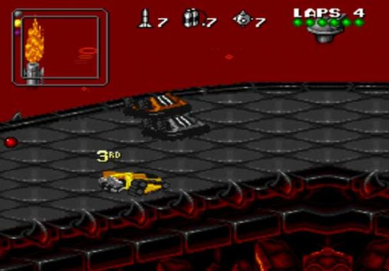

# 3D

Technique de rendu visuel qui permet la gestion des 3 axes de l'espace (X, Y, Z). Si les graphismes en 2D bitmap ne sont que le remplissage d'une matrice à l'aide de couleurs, l'ordinateur n'ayant qu'à reproduire l'affichage, la 3D nécessite le calcul de tout l'environnement.

Les objets, éléments de l'affichage (que ce soit un personnage ou un arbre) sont composés de formes primitives (cube, cylindres...) eux-même formés par des vertices (sommets des formes, vertex au singulier) et des splines (l'arrête d'un carré par exemple) pouvant être modifiés pour adapter la forme primitive aux besoins.

On distingue, le temps passant, diverses méthodes d'affichage en 3D :

- **wireframe** ou fils de fers : seuls les splines et les vertices sont visibles : les faces sont transparentes (Star Wars sur C64 par exemple)

- **faces pleines** : les faces sont colorées avec une couleur unie. C'est ce qu'on rencontre le plus souvent dans les jeux du début des années 90 (Drakkhen par exemple)

- **3D texturée** : des textures sont plaquées sur les faces des objets et permettent ainsi le rendu de matières. Exemple : Doom

- **3D avec shading** : le shading permet une meilleure gestion de la réflection de la lumière sur les objets (gestion des ombres) et un meilleur rendu de la tessiture des matières. Différents types de shading existent tels que le Gouraud Shading ou le Phong Shading.

On distingue également **3D temps réel** et **3D précalculée**. Si la deuxième a été calculée à l'avance, l'ordinateur n'ayant plus qu'à afficher le résultat, la première méthode consiste en le calcul de l'univers pendant son exploration : cela permet une meilleure interactivité (en précalculée, on ne peut se déplacer que dans les portions de l'univers qui ont déjà été calculées) mais nécessite une plus grande puissance durant le jeu.

Les machines actuelles disposent de fonctions en hard permettant de soulager le microprocesseur de la majeure partie du calcul 3D, qui est très lourd. Cela a permis l'introduction de nouveaux filtres (anti-aliasing,, lens flare, T&L... ) améliorant encore le rendu visuel. Dans un environnement Windows, plusieurs API permettent de faciliter l'utilisation de la 3D par les programmeurs. Les plus connues sont Direct3D et OpenGL.

# 3D isométrique

Se dit d'une vue aérienne pivotée sur 45°. Souvent qualifié de pseudo-3D, cela reste bel et bien de la 2D. La 3D isométrique offre une meilleure impression de profondeur que la 2D classique grâce un effet de vue plongeante. Parmi les jeux offrant ce type de vue, on peut citer Solstice sur NES, Cadaver ou D/Generation tous deux sur ordinateurs 16/32 bits et PC.

